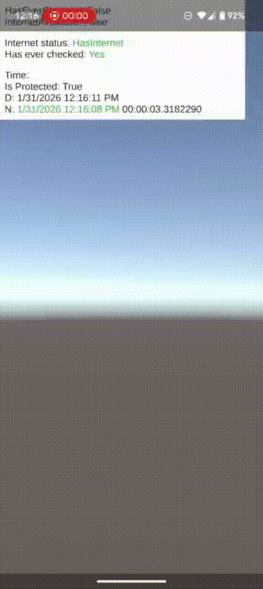

# PCore Networking (early alpha)

Unity package for monitoring **internet availability** and **trusted UTC time** with anti–time-tampering protection.

Designed for mobile & desktop games that need:

- reliable internet state
- protection against device time manipulation
- simple static API
- optional reactive bindings (UniRx / R3)
- UniTask-based async (no coroutines, no thread issues)




---

## ✨ Features

- 🌐 Internet availability check via configurable HTTP endpoint
- ⏱ Server-based UTC time synchronization (via HTTP `Date` header)
- 🛡 Protection against device time rewind / fast-forward
- 💤 Automatic pause & focus handling
- ⚡ UniTask-based (main-thread safe)
- 🔁 Optional reactive API:
  - UniRx (`PCORE_NETWORK_UNIRX`)
  - R3 (`PCORE_NETWORK_R3`)
- 📦 Unity Package Manager compatible (Git URL)

---

## 📦 Installation (Unity Package Manager)

### Via Git (recommended)

```
https://github.com/pashara/PCoreNetworking-Unity/tree/dev/0.0.1
```

Or via `Packages/manifest.json`:

```json
"com.pcore.networking": "https://github.com/pashara/PCoreNetworking-Unity/tree/dev/0.0.1",
```
---

## 🔧 Requirements

- Unity 2020.3+
- [UniTask (Cysharp.Threading.Tasks)](https://github.com/Cysharp/UniTask)

Optional:

- [UniRx](https://github.com/neuecc/UniRx) (add `PCORE_NETWORK_UNIRX` in scripting define symbols)
- [R3](https://github.com/Cysharp/R3) (add `PCORE_NETWORK_R3` in scripting define symbols)

> Enable **only one** reactive define at a time.

---


## 🚀 Public API

```csharp
// Internet
bool PNetworkState.InternetAvailable
IReactiveProperty<bool> PNetworkState.InternetAvailableRx  // <--- UniRX/R3
event Action<bool> PNetworkState.OnInternetStatusChanged
bool PNetworkState.HasEverChecked

// Time protection
bool PNetworkState.TimeProtected
IReactiveProperty<bool> PNetworkState.TimeProtectedRx // <--- UniRX/R3
event Action<bool> PNetworkState.OnTimeProtectedChanged
DateTime PNetworkState.UtcNow
DateTime PNetworkState.Now
```

---

## ⚙️ Configuration (Optional)

Create config asset:
>Assets → PCore → Networking → Config

in the root of the `Resources` folder, for example

```
Assets/Resources/PNetworkStatusConfig.asset
### or ###
Assets/YourGamePart/Resources/PNetworkStatusConfig.asset
```

Config fields:

- `PingUrl` – endpoint for internet check (default: `https://clients3.google.com/generate_204`)
- `SuccessResponse` – expected response (HTTP code or body)
- `SecondsBetweenChecks` – polling interval
- `TimeoutSeconds` – request timeout
- `DeviceTimeToleranceMinutes` – allowed device/server time delta


---

## 🛡 Time Protection Logic

- Server UTC is taken from HTTP `Date` header
- Internal time is based on `Time.realtimeSinceStartup`
- Device clock changes do **not** affect protected time
- Protection resets on `ApplicationPause(true)`
- Protection restored after successful re-sync

If device time differs from server time by more than tolerance:

- device time is considered **untrusted**
- server-based time is still used

---

## ❗ Notes

- Designed for **anti-cheat / offline reward / cooldown logic**
- Not a replacement for NTP-level precision
- Server must return valid HTTP `Date` header

---

## 📜 License

MIT License  
© 2026 Pavel Sapuryn
